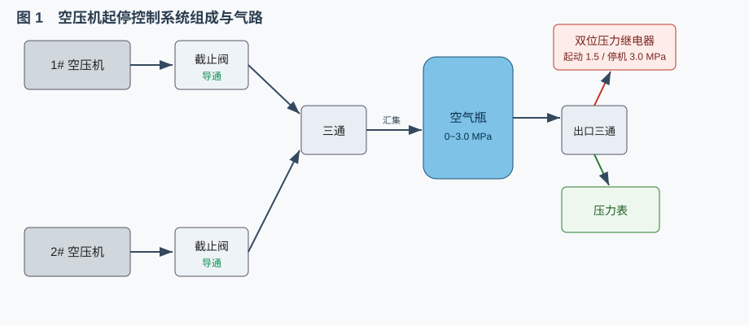
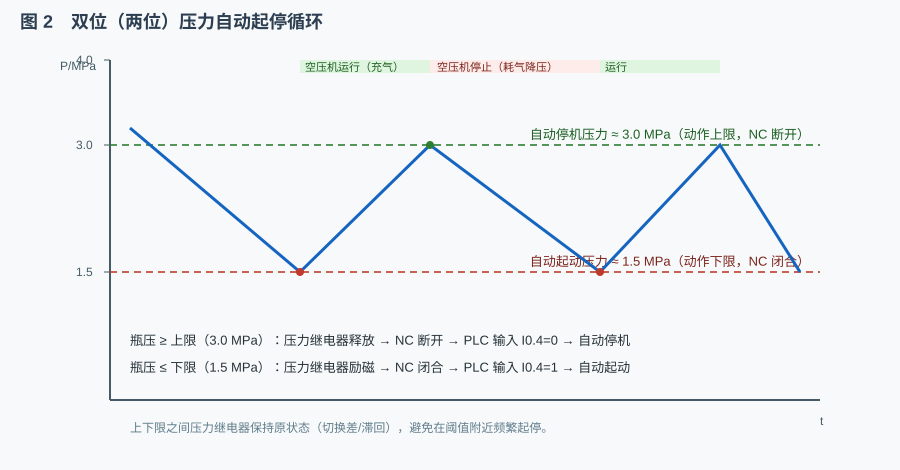
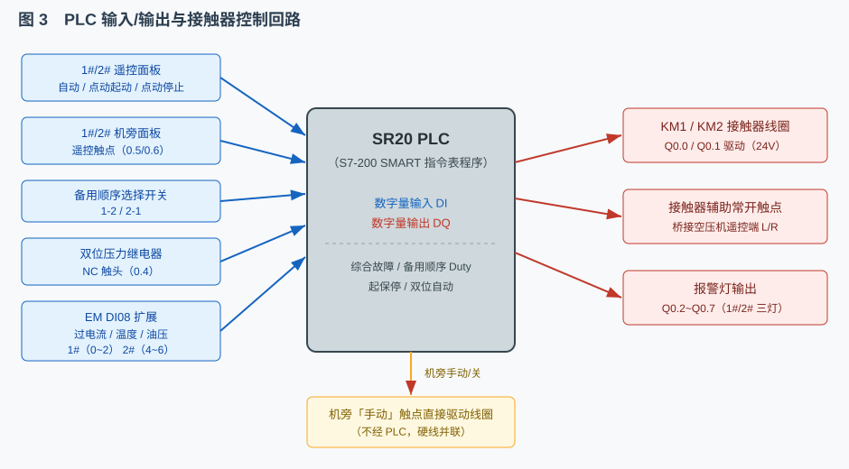
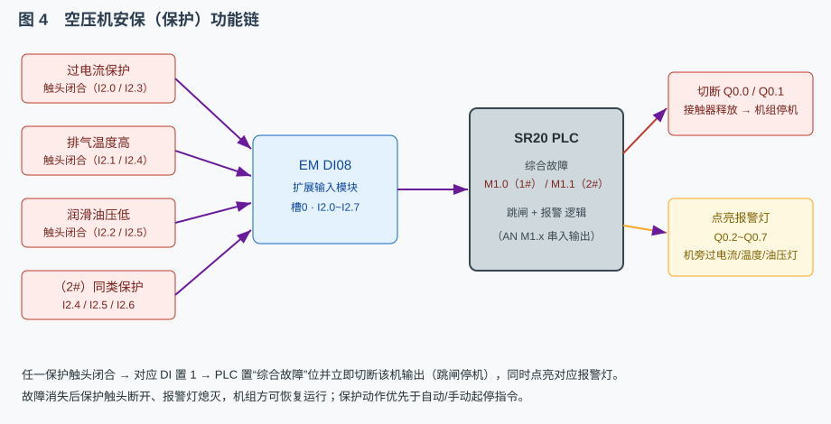
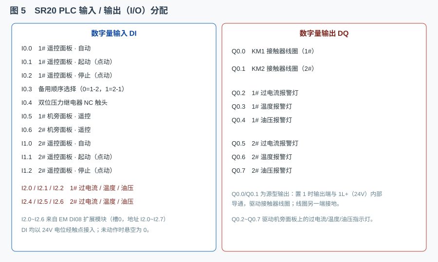

# 空压机起停控制系统

> 本系统以船舶辅机——主空气压缩机的起动、停止为核心，采用「SR20 PLC + 接触器 + 双位压力继电器」实现两台空压机的机旁手动起停、遥控手动起停与自动起停控制，并具备过电流、排气温度高、润滑油压低等安保功能。系统分两个画布页面：页 1 为空压机气路与机旁控制、接触器，页 2 为遥控面板与 PLC 控制。

## 一、系统概述

空压机起停控制系统由「被控对象」「执行机构」「控制中枢」三部分组成（见图 1）。



- **被控对象**：两台主空气压缩机（1#、2#）。每台空压机的排气口经一只**单向截止阀**后，接入一台**三通接头**的上/下端；三通右端汇入**唯一一台空气瓶**的入口。空气瓶出口经出口三通分两路：一路接**双位压力继电器**（检测瓶压、给出起停触点），一路接**压力表**（就地显示）。
- **执行机构**：两台交流接触器 KM1、KM2。接触器的**线圈**由 24V 控制回路驱动，其**辅助常开触点**桥接对应空压机的遥控控制端 L/R——触点闭合即视为“遥控起动”，触点断开即视为“遥控停止”。这正是“**接触器控制压缩机起停**”的实现方式。
- **控制中枢**：西门子 S7-200 SMART ST20（工程中作 SR20），外加一块 EM DI08 数字量输入扩展模块用于接入保护信号。PLC 采集面板开关、压力继电器与保护触头等输入信号，按指令表程序运算后，由输出端驱动接触器线圈与报警指示灯。

系统的两条控制主线是：**自动起停**（双位压力继电器 + PLC 双位控制）与**手动起停**（机旁硬线、遥控面板经 PLC）。二者共享接触器与空压机，但优先级不同——保护动作最高，其次“关”位，再次手动/自动指令。

## 二、空压机自动起停的工作原理

### 2.1 双位（两位）压力控制

所谓“双位”，是指控制量只有“接通”和“断开”两个状态，中间带有**切换差（回差/滞回）**，避免在阈值附近频繁动作。本系统用一只**双位压力继电器**检测空气瓶出口压力，其动作规律为：

- 瓶压**低于动作下限**（本系统约 **1.5 MPa**）时，继电器**励磁**，常闭触点 NC 保持**闭合**；
- 瓶压**高于动作上限**（本系统约 **3.0 MPa**）时，继电器**释放**，NC 触点**断开**；
- 在上下限之间，继电器保持上一次状态不变。

于是，空气瓶压力随时间呈现“锯齿波”式循环（见图 4）：瓶压低→空压机自动起动充气→瓶压升到上限→空压机自动停机→系统耗气使瓶压下降→再次起动……形成完整的“充气—停机—耗气—再起动”双位控制循环。



本系统压力继电器采用 YT1226 型：给定值调节范围为 0~2 MPa、切换差范围为 0.7~2.5 MPa。按初始“给定值 75%、切换差 44.4%”换算，动作下限（自动起动压力）≈1.5 MPa，动作上限（自动停机压力）≈3.0 MPa。

### 2.2 PLC + 接触器控制回路

自动起停并非继电器直接串入电机主电路，而是“**压力继电器→PLC 输入→PLC 程序→PLC 输出→接触器线圈→接触器辅助触点→空压机遥控端 L/R**”这一完整信号链（见图 2）。



- 压力继电器的 NC 触点一端接 24V 电位端子、另一端接 PLC 输入 **I0.4**；瓶压低时触点闭合，I0.4=1。
- PLC 程序在“压力低、该机处于遥控、该机面板处于自动、且该机为当前主用机”四个条件同时满足时，把对应输出 **Q0.0（KM1）/Q0.1（KM2）** 置 1。
- 源型输出的 Q 端与 1L+（24V）内部导通，驱动接触器线圈（线圈另一端接地）；接触器吸合后其辅助常开触点闭合，桥接空压机 L/R，空压机即按遥控方式运转。
- 瓶压升到上限时 NC 断开、I0.4=0，PLC 输出归 0，接触器释放、空压机停机。

### 2.3 备用顺序选择与故障自动切换

两台空压机共用一台空气瓶，自动工况下**只允许运行一台**（主用机），另一台作为备用。为此设置一只**备用顺序选择开关**：

- 旋钮打在**左上 45°**＝顺序 **1-2**（1# 主用、2# 备用）；
- 旋钮打在**右上 45°**＝顺序 **2-1**（2# 主用、1# 备用）。

该开关一端接 24V 电位端子、另一端接 PLC 输入 **I0.3**。程序据此计算两台机的“主用允许位”Duty1/Duty2。若当前**主用机发生故障**（保护动作），程序自动把主用允许位切到另一台，实现“**主用故障、备用接替**”。但如果备用机**并非处于自动档**，则不会自动起动——避免用错控制方式。

### 2.4 机旁与遥控手动起停

除自动外，系统还支持两种手动方式：

- **机旁手动**：机旁面板「空压机控制」旋钮打到“手动”时，24V 经机旁“手动”触点**直接**接通接触器线圈（不经 PLC）——“手动”与 PLC 输出是并联的两条线圈驱动支路，串联机旁“关”常闭触点；切到“关”则断开线圈回路使接触器释放。
- **遥控手动**：机旁旋钮切到“遥控”后，由遥控面板上“运行/停止”**点动按钮**经 PLC 起保停逻辑控制起停。“起保停”即“起动—自保持—停止”：按下起动按钮瞬间给出一个起动脉冲，程序自锁输出；按下停止按钮解除自锁。

## 三、空压机的安保功能

空压机属高温、高压辅机，必须设置完善的安保（保护）功能。本系统的保护量为**过电流、排气温度高、润滑油压低**，保护链见图 5。



1. **保护信号的产生**：过电流、温度、油压任一越限时，现场保护装置的触点（工程中体现为机旁面板上的“过电流/温度/油压”保护触头）**闭合**；
2. **信号送入 PLC**：这些触头一端接 24V 电位端子，另一端接 EM DI08 扩展模块的输入通道（1#：I2.0/I2.1/I2.2；2#：I2.4/I2.5/I2.6）。触头闭合即对应输入位为 1；
3. **程序判定与跳闸**：程序把每台机的三个保护输入相“或”，得到该机的“综合故障”标志 M1.0（1#）/M1.1（2#）；输出表达式中串入 `AN M1.x`，一旦有故障立即把 Q0.0/Q0.1 清零，接触器释放、机组停机（跳闸）；
4. **报警灯输出**：程序同时用 Q0.2~Q0.4 驱动 1# 的过电流/温度/油压报警灯，Q0.5~Q0.7 驱动 2# 的三个报警灯，提示操作人员故障种类；
5. **保护优先**：保护动作的优先级最高，凌驾于自动与手动起停之上——只要故障存在，无论程序内部是否请求起动，输出都被封锁；故障排除、触头复位后报警灯熄灭、机组方可恢复。

此外，单向截止阀本身也是一种**机械保护**：它只允许气体单向流动，防止空气瓶内的高压气体在空压机停机时倒流冲击机组。工程中还在机旁面板设有“电机加热”开关与指示灯——空压机停机时投入曲轴箱电加热，防止润滑油凝结；当空压机运行时加热器停用（加热指示灯熄灭）。

## 四、PLC 控制程序逐行解读（重点）

程序用 S7-200 指令表（STL/IL）编写，采用“**先故障判定 → 再主备选择 → 再逐台起保停/自动 → 最后输出**”的结构。I/O 分配见图 3。



### 4.1 输入 / 输出分配

- 数字量输入 DI：`I0.0/I0.1/I0.2`＝1# 遥控面板 自动/起动/停止；`I0.3`＝备用顺序开关；`I0.4`＝压力继电器 NC；`I0.5/I0.6`＝1#/2# 机旁“遥控”；`I1.0/I1.1/I1.2`＝2# 遥控面板 自动/起动/停止；EM DI08：`I2.0/2.1/2.2`＝1# 过电流/温度/油压，`I2.4/2.5/2.6`＝2# 同类保护。
- 数字量输出 DQ：`Q0.0`＝KM1 线圈，`Q0.1`＝KM2 线圈，`Q0.2~Q0.7`＝六只报警灯。
- 中间标志 M：`M0.0/M0.2`＝1#/2# 自动请求；`M0.1/M0.3`＝1#/2# 手动起保停；`M1.0/M1.1`＝1#/2# 综合故障；`M2.0/M2.1`＝1#/2# 主用允许。

### 4.2 程序逐段解读

**第一段：综合故障判定。** 把每台机的三个保护输入相“或”，得到该机的综合故障位：

```
LD     I2.0          // 1# 过电流
O      I2.1          // 1# 温度高
O      I2.2          // 1# 油压低
=      M1.0          // → 1# 综合故障
LD     I2.4          // 2# 过电流
O      I2.5          // 2# 温度高
O      I2.6          // 2# 油压低
=      M1.1          // → 2# 综合故障
```
`LD` 装载第一个输入并开始一个逻辑块，`O` 逐一“逻辑或”其余输入，`=` 把块结果写入 M1.0/M1.1。只要任一保护动作，对应故障位即为 1。

**第二段：备用顺序选择（主用允许位）。** 由顺序开关 I0.3（0＝1-2，1＝2-1）和故障位共同决定：

```
LDN    I0.3          // NOT SEL：开关=1-2 时块1为真
LD     M1.1          // 2# 故障
OLD                  // 块1 OR 块2：  (1-2) 或 (2#故障)
AN     M1.0          // 且 1# 不故障
=      M2.0          // → 1# 主用允许 Duty1

LD     I0.3          // SEL：开关=2-1 时块1为真
LD     M1.0          // 1# 故障
OLD                  // (2-1) 或 (1#故障)
AN     M1.1          // 且 2# 不故障
=      M2.1          // → 2# 主用允许 Duty2
```
这段“并联支路”用到了逻辑块指令 `OLD`：`LD` 把前一个逻辑块压栈、装载新块，`OLD` 再把两者相“或”。其含义是：
- Duty1＝（选 1-2 **或** 2# 已故障）**且** 1# 未故障；
- Duty2＝（选 2-1 **或** 1# 已故障）**且** 2# 未故障。

于是正常情况下按开关选定主用机；一旦主用机故障，其故障位把“主用允许”自动让给另一台，实现主备切换。若两台同时故障，两个允许位都为 0，自动停机。

**第三段：1# 自动请求。** “压力低 + 遥控 + 本机自动 + 本机主用”四条件同时满足才请求自动起动：

```
LD     I0.4          // 压力低（压力继电器 NC 闭合）
A      I0.5          // 1# 机旁处于遥控
A      I0.0          // 1# 遥控面板处于自动
A      M2.0          // 1# 为主用机
=      M0.0          // → 1# 自动请求
```
`A` 为“逻辑与”。四个条件缺一不可：特别地，`AN I0.0` 不存在，而是以 `A I0.0` 要求**本机面板必须在自动档**——这正是修正后的关键点：若顺序开关为 2-1 而 2# 面板仍在手动，则 2# 的自动请求不会成立，2# 不会自动起动。

**第四段：1# 手动起保停（点动）。** 遥控面板的起动/停止是点动按钮，需程序自锁：

```
LD     I0.1          // 起动按钮（点动脉冲）
O      M0.1          // 自保持
AN     I0.2          // 且 停止按钮未按
A      I0.5          // 且 遥控
AN     I0.0          // 且 不在自动档（即手动档）
=      M0.1          // → 1# 手动运行
```
`LD … O M0.1` 构成自锁：按下起动瞬间 M0.1 置位，松开后由 `O M0.1` 维持；按停止使 `AN I0.2` 为假、解除自锁。`AN I0.0` 保证手动与自动互斥。

**第五段：1# 输出（含故障封锁）。** 自动与手动相“或”，再串入“无故障”：

```
LD     M0.0          // 自动请求
O      M0.1          // 或 手动运行
AN     M1.0          // 且 1# 无综合故障
=      Q0.0          // → 驱动 KM1 线圈
```
只要 1# 有故障，`AN M1.0` 即为假，Q0.0 被强制为 0，接触器释放、机组跳闸——保护优先于此得到保证。

**第六段：2# 自动与手动。** 与 1# 完全对称，仅输入地址不同：

```
LD     I0.4          // 压力低
A      I0.6          // 2# 遥控
A      I1.0          // 2# 面板自动
A      M2.1          // 2# 主用
=      M0.2          // → 2# 自动请求

LD     I1.1          // 2# 停止…见下
O      M0.3
AN     I1.2
A      I0.6
AN     I1.0
=      M0.3          // → 2# 手动运行

LD     M0.2
O      M0.3
AN     M1.1
=      Q0.1          // → 驱动 KM2 线圈
```
（注：上文 2# 手动块的起动/停止按钮为 `I1.1`/`I1.2`，自保持位 `M0.3`，与 1# 结构一致。）

**第七段：报警灯输出。** 直接把保护输入映射到指示灯：

```
LD     I2.0     =  Q0.2   // 1# 过电流灯
LD     I2.1     =  Q0.3   // 1# 温度灯
LD     I2.2     =  Q0.4   // 1# 油压灯
LD     I2.4     =  Q0.5   // 2# 过电流灯
LD     I2.5     =  Q0.6   // 2# 温度灯
LD     I2.6     =  Q0.7   // 2# 油压灯
```
`END` 结束程序。CPU 每个扫描周期（约 15 ms）重复执行上述全部逻辑，因此对输入变化的响应几乎是实时的。

### 4.3 时序小结

以“自动 2-1”为例：瓶压下降→I0.4=1→（I0.6、I1.0、M2.1 均成立）→M0.2=1→Q0.1=1→KM2 吸合→2# 空压机运转充气→瓶压升到上限→I0.4=0→M0.2=0→Q0.1=0→KM2 释放→2# 停机。若此时 2# 发生过电流，其保护触头闭合使 I2.3 为 1、M1.1=1，则 Duty2 立即置 0、Duty1 置 1，主用切换到 1#；只要 1# 面板也在自动档，1# 即自动接替运行，同时 2# 的报警灯点亮。

## 五、操作流程与实训要点

**流程一：空压机的机旁起停和遥控手动起停。** 依次为：①认识 1# 机旁面板；②认识 1# 遥控面板；③点击“自动接线”接好线路、打开两台截止阀；④在机旁面板把旋钮切到“手动”→接触器吸合、机组运行；⑤待瓶压 > 3.5 MPa 后把旋钮切回“关”停机；⑥把旋钮转到“遥控”；⑦在遥控面板选“手动”并点动“运行”起动；⑧点动“停止”遥控停机。

**流程二：空压机的自动起停控制。** 依次为：①自动接线并打开两台截止阀；②把 1#、2# 机旁旋钮都转到“遥控”；③备用顺序开关改为 2-1；④把两台遥控面板都改为“自动”；⑤在机旁界面观察 2# 空压机随瓶压自动起动与自动停机（演练模式下需观察到一次起动和一次停机）；⑥打开压力开关配置界面，核对自动起动/自动停机的压力设定。

**实训要点与故障排查**：
- 自动不起动：先查该机是否处于“遥控+自动”，再看它是否为当前主用机，最后确认压力继电器触点与接线、PLC 是否 ON/RUN。
- 自动不停机：检查压力继电器动作上限、切换差，以及压力表读数是否已越过上限。
- 机组跳闸报警：对照 I2.x 报警输入定位故障种类，排除后保护触头复位、报警灯熄灭方可复位运行。
- 顺序开关失效：确认开关在 2-1（右上 45°），对应输入 I0.3=1；若备用机不在自动档，主用故障时不会自动接替。

掌握以上原理与程序，即可完成空压机从就地手动、远方手动到全自动的双位起停控制与安保处理。
